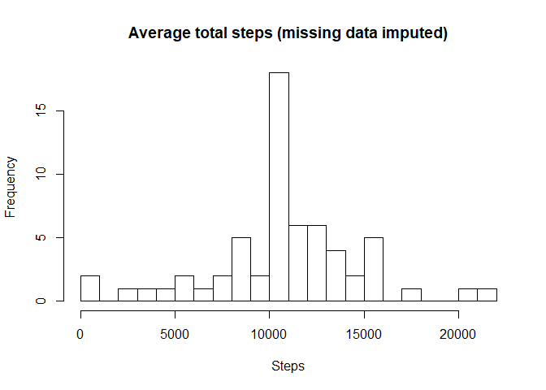

## Loading and preprocessing the data

```r
library(readr)
myData <- read_csv("activity.zip")
```

```
## Rows: 17568 Columns: 3
```

```
## -- Column specification --------------------------------------------------------
## Delimiter: ","
## dbl  (2): steps, interval
## date (1): date
```

```
## 
## i Use `spec()` to retrieve the full column specification for this data.
## i Specify the column types or set `show_col_types = FALSE` to quiet this message.
```


## What is mean total number of steps taken per day?

```r
library(dplyr)
```

**Summarising the mean and median by interval across the dataset.**

```r
daily_steps <- myData %>%
    summarise(mean = mean(steps, na.rm = TRUE), median = median(steps, na.rm = TRUE))
daily_steps
```

```
## # A tibble: 1 x 2
##    mean median
##   <dbl>  <dbl>
## 1  37.4      0
```


```r
hist(myData$steps, main = "Average daily steps", xlab = "Steps")
```


## What is the average daily activity pattern?

```r
interval_steps <- myData %>%
    group_by(interval) %>%
    summarise(mean_steps = mean(steps, na.rm = TRUE))
interval_steps
```

```
## # A tibble: 288 x 2
##    interval mean_steps
##       <dbl>      <dbl>
##  1        0     1.72  
##  2        5     0.340 
##  3       10     0.132 
##  4       15     0.151 
##  5       20     0.0755
##  6       25     2.09  
##  7       30     0.528 
##  8       35     0.868 
##  9       40     0     
## 10       45     1.47  
## # ... with 278 more rows
```


```r
plot(interval_steps$interval, interval_steps$mean_steps, type = "l", main = "Average steps breakdown", xlab = "Interval", ylab = "Average number of steps")
```


```r
interval_steps[which.max(interval_steps$mean_steps),]
```

```
## # A tibble: 1 x 2
##   interval mean_steps
##      <dbl>      <dbl>
## 1      835       206.
```
On average, across all days in the dataset, interval 835 contains the maximum number of steps, i.e., 206.1698113.


## Imputing missing values
**The total number of missing values in the dataset**

```r
length(myData[is.na(myData)])
```

```
## [1] 2304
```

**Imputing missing values by filling in the mean for that 5-minute interval**

```r
filled_data <- myData
for (i in interval_steps$interval) {
    filled_data[which(filled_data$interval == i & is.na(filled_data$steps)), "steps"] <- interval_steps[which(interval_steps$interval == i), "mean_steps"]
}
filled_interval_steps <- filled_data %>% summarise(mean_steps = mean(steps), median_steps = median(steps))
filled_interval_steps
```

```
## # A tibble: 1 x 2
##   mean_steps median_steps
##        <dbl>        <dbl>
## 1       37.4            0
```
After imputing missing values with the mean for each 5-minute interval, there is no change to either the mean or the median of the dataset.


```r
hist(filled_data$steps, main = "Average daily steps (missing values imputed)", xlab = "Steps")
```



Comparing the two histograms, the general shapes of the two are same. The only difference is the frequency of 0 steps taken.


## Are there differences in activity patterns between weekdays and weekends?
**Categorizing dates into weekdays and weekends**

```r
filled_data <- filled_data %>% mutate(category = factor(ifelse(weekdays(date) %in% c("Saturday", "Sunday"), "weekends", "weekdays")))
head(filled_data)
```

```
## # A tibble: 6 x 4
##    steps date       interval category
##    <dbl> <date>        <dbl> <fct>   
## 1 1.72   2012-10-01        0 weekdays
## 2 0.340  2012-10-01        5 weekdays
## 3 0.132  2012-10-01       10 weekdays
## 4 0.151  2012-10-01       15 weekdays
## 5 0.0755 2012-10-01       20 weekdays
## 6 2.09   2012-10-01       25 weekdays
```

**Create a panel plot**

```r
library(ggplot2)
filled_data %>%
    group_by(interval, category) %>%
    summarise(mean_steps = mean(steps)) %>%
    ggplot(aes(x = interval, y = mean_steps)) + geom_line() + facet_wrap(facets = vars(category),
    nrow = 2) + theme_light() + ylab("Average number of steps") + ggtitle("Average number of steps by weekdays/weekends",
    subtitle = "Missing data imputed") + theme(plot.title = element_text(hjust = 0.5),
    plot.subtitle = element_text(hjust = 0.5))
```


